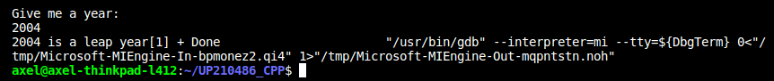

## Programas unidad 3  

  # 01-BISECCION     
    
    THIS PROGRAM DO A BISSECTION.  
          

  
  </div>  


  ``` #include <iostream>
#include <cmath>
using namespace std;

double FuncionEcuacion1(double x){
    return (pow(x,2)-8*x+15);
}

int main(){
    double x1=-10;
    double x2=4.5;
    double xm,y1,y2;

    double Es=0.00001;
    double Er=abs(x2-x1);
    
    int i=1;
    while (Er>Es){
        xm=(x1+x2)/2;
        y1=FuncionEcuacion1(x1);
        y2=FuncionEcuacion1(xm);
        if (y1*y2 <0 ){
            x2=xm;
        } else {
            x1=xm;
        }
        Er=abs(x2-x1);
        i=i+1;
    }
    cout<<"i = "<<i<<" raiz = "<<xm<<endl;
    cout<<"... Hecho">> endl;
    return 0;
}
```  
---  

## 02-LEAP YEAR 


THIS PROGRAM ASK THE USER ONE YEAR AND THEN THE PROGRAMS SAYS IF THE YEAR IS A LEAP YEAR OR NO.

   
  </div>   
    

  </div> 

  ```  
    
    #include <iostream>
using namespace std;

bool Leap(int year){
    bool r;
    r = year%400==0 || year%4==0 && year%100!=0;
    return r;
}

int main(){
int year;
cout<<"Give me a year: " << endl;
cin>>year;
if(Leap(year)){
    cout<<year<<" is a leap year";
} else{
    cout<<year<<" isnt a leap year";
}
return 0;
}
```  
---  

## 03- COSINE
THIS PROGRAM IS GOING TO SHOW THE RESULT OF DE COSINE FUNCTION OF 45 DEGREES.  


  </div>  
  
```#include <iostream>
#include <math.h>
using namespace std;

double G2R(double g){
    double r;
    r=g*M_PI/180;
    return r;
}

long int factorial(int x){
    int factorial=1;
    while (x>0)
    {
        factorial=factorial*x;
        x--;
    }
    return factorial;
}

double cosine(double g, int i){
    double c;
    c=pow(-1,i)*pow(G2R(g),2*i)/(factorial(2*i));
    return c;
}

int main(){
    int g=45;
    double x1=10;
    double Es=0.00001;
    double c=0;

    double Er=x1-c;
    int i=0;

    while(Er>Es){
        x1=c;
        c=c+cosine(g,i);
        Er=abs(x1-c);
        i++;
    }
    cout<<"The cosine of "<<g<<" degrees is : "<< c << endl;
    return 0;
}
```  
---  

  
## 04-POPULATION STANDARD DEVIATION    
THIS PROGRAM GIVE TO DE USER THE HALF AND THE POPULATION STANDAR DEVIATION OF THE DATAS:  

- 600  

- 470  

- 170  

- 430  

- 300  
  


  </div>   

```#include <iostream>
#include <math.h>
using namespace std;

double half(double x[], int n)
{
    double half = 0;
    for (int i = 0; i < n; i++)
    {
        half = half + x[i];
    }
    half = half / n;
    return half;
}

double deviation(double x[], int n)
{
    double h = half(x, n);
    double dev = 0;
    for (int i = 0; i < n; i++)
    {
        dev = dev + pow(x[i] - h, 2);
    }
    dev = sqrt(dev / n);
    return dev;
}

int main()
{
    double numeros[] = {600, 470, 170, 430, 300};
    int n;
    n = sizeof(numeros) / 8;
    cout << "Half: " << half(numeros, n) << endl;
    cout << "Standar deviation: " << deviation(numeros, n) << endl;
    return 0;
}
```  
   ---  

## 05 CURRENCY BREAKDOWN      
THIS PROGRAM GIVE DE CHANGE IN BILLS OF 3699 DOLLARS GIVING THE LEAST AMOUNT OF EVERY BILL.

  </div>    

  
  ```#include<iostream>
using namespace std;
int main(){
    int money =3699, i=0;
    int change[10]={1000,500,200,100,50,20,10,5,2,1};
    while (money>0)
    {
        if (money>=change[i])
        {
            cout<<money/change[i]<< " bills of  " <<change[i]<<endl;
            money=money%change[i];
        }
        i++;
    }
    return 0;
}
```  
---  

  
  ## 06 ROMAN NUMBERS      
THIS PROGRAM GIVE TO THE USER THE ARABIC NUMBER 2022 IN ROMAN NUMBERS.   

  </div>    

  
  ```#include <iostream>
using namespace std;

int main()
{
    int n = 2022;
    int v;
    int roman[] = {1000, 900, 500, 400, 100, 90, 50, 40, 10, 9, 5, 4, 1};
    string RN[] = {"M", "CM", "D", "CD", "C", "XC", "L", "XL", "X", "IX", "V", "IV", "I"};
    string number = "";
    int i = 0;
    while (n > 0)
    {
        if (n >= roman[i])
        {
            v = n / roman[i];
            n = n % roman[i];
            for (int j = 0; j < v; j++)
            {
                number = number + RN[i];
            }
        }
        i++;
    }
    cout << number << endl;
    return 0;
}
```  
---  
  
  ## 07 RFC      
THIS PROGRAM DO THE "RFC" OF THE PEOPLE CLUDED IN THE TABLE GIVENN VY THE TEACHER.

  </div>    

  
  ```#include <iostream>
#include <iostream>
#include <cstring>
using namespace std;

int main(){
    string nombre="Juan ";
    string AP="Jimenez";
    string AM="Esparza";
    string fe="03/08/1987";
    string rfc="";
    int v=nombre.length(); 
    int p=0;
    
    rfc=rfc+AP[0];
    for (int i = 1; i < v && p<1; i++)
    {
        if (AP[i]=='a' || AP[i]=='e' || AP[i]=='i' || AP[i]=='o' || AP[i]=='u' )
        {
            rfc=rfc+AP[i];
            p++;
        }  
    }

    int d1=fe.find_last_of("/");
    int d2=fe.find("/");
    rfc=rfc+AM[0]+nombre[0]+fe.substr(d1+1,4)+fe.substr(d2+1,2)+fe.substr(0,2);
    
    v=rfc.length();
    for (int i = 0; i < v; i++)
    {
        rfc[i]=toupper(rfc[i]);
    }
    cout<<nombre<<" RFC: "<<rfc << endl;
    return 0;
}
```    
---  

## 08 ORGANIZE ARRAY 
IN THIS PROGRAM AN ALGORITHM CHECKS ALL THE NUMBERS IN THE ARRAYS AND THEN THIS ALGORITHM ORDER IN AN UPWARD ORDER.
    

  
  ```#include <iostream>
using namespace std;

void ordenar(int x[], int v)
{
    int m, s, c;
    do
    {
        c = 0;
        for (int i = 0; i < v; i++)
        {
            s = i + 1;
            if (x[i] > x[s])
            {
                m = x[s];
                x[s] = x[i];
                x[i] = m;
                c++;
            }
        }

    } while (c > 0);
}

int main()
{
    int c[] = {9, 8, 7, 6, 5, 4, 3, 2, 1, 0};
    int n = sizeof(c) / 4;
    ordenar(c, n);
    for (int i = 0; i < n; i++)
    {
        cout << c[i] << endl;
    }
    return 0;
}
}
```  